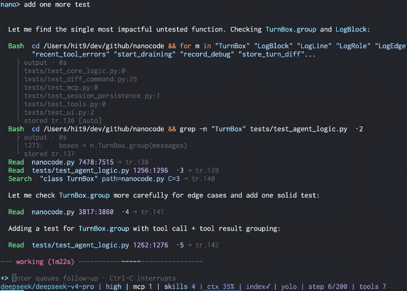

<h1 align="center">minacode</h1>

<p align="center">
  
</p>

<p align="center">
  A coding agent I use, maintain, and customize, shipped as a small, focused Python package.
</p>

<p align="center"><a href="README.zh-CN.md">中文</a></p>

## Safety

**Use at your own risk.** minacode can edit files and run shell commands in the environment where it starts. It does not provide sandbox isolation; use a container or VM when needed.

## What it is

minacode does not introduce a new kind of coding agent. It combines familiar features — reading and editing files, running commands, follow-ups, sessions, diffs, MCP, and skills — into a tool I use personally.

It works on real repositories, including its own: I use minacode to build and maintain minacode. Everything ships in a small, focused Python package, so I can change the behavior directly whenever I want the workflow to work differently.

<p align="center">
  
</p>
<p align="center"><sub>Resuming a saved session with its conversation and tool history.</sub></p>

## Highlights

- **Prompt-cache aware:** stable request prefixes let supported providers reuse work and can reach 90–99% cache hit rates; `/status` shows the reported result.
- **Code navigation:** jump to definitions, callers, and implementations with a searchable code index.
- **Live follow-ups:** type while the agent works; `Enter` queues a message for the next model step, while `Ctrl-C` discards a draft or interrupts the task once the input is empty.
- **Anchored edits:** structured edits use `line:hash` anchors and reject stale file content.
- **Resumable sessions:** conversation, tool calls, diffs, and working memory survive `-c` or `--resume`.
- **Built-in diff viewer:** `/diff` shows the latest round and the net session result.
- **MCP and skills:** connect Model Context Protocol servers and load Markdown instruction packs on demand.
- **Provider compatibility:** OpenAI-compatible APIs and Anthropic.

## Install

Requires macOS or Linux, Python 3.11+, and [uv](https://docs.astral.sh/uv/).

```sh
uv tool install minacode
minacode --init-config
```

Add your provider to `~/.minacode/config.toml`:

```toml
[provider]
active = "default"

[provider.default]
url = "https://api.deepseek.com"
key = "sk-..."
model = "deepseek-v4-flash"
```

Then run:

```sh
minacode
```

Upgrade with `uv tool upgrade minacode`.

## Links

- [Documentation](https://minacode.readthedocs.io/en/latest/) — full usage guide and reference.
- [Blog post](https://hit9.dev/post/minacode) — why and how it was built.
- [code-symbol-index](https://github.com/hit9/code-symbol-index) — the code index library minacode uses.
