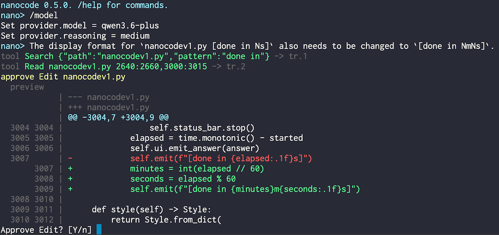

# nanocode

一个用 Python 写的小型终端编程代理。

[English](README.md)

[中文博客](https://hit9.dev/post/nanocode)

nanocode 仍是 1.0 前的软件。稳定版发布前，命令、配置和工具行为都可能变化。



## 特性

- **实时回合控制**：代理还在工作时，也可以追加输入，不打断当前工具流程。
- **文件状态大脑**：`Read` 和 `Edit` 会构建当前重要文件的带行号视图。
- **过期编辑保护**：`line:hash` 锚点会在目标代码漂移后拒绝错误编辑。
- **项目级导航**：通过符号索引快速查看 outline、references 和变更文件。
- **可恢复上下文**：prompt 中的工具输出保持有界，原始 `tr.N` 结果仍可按需召回。
- **缓存友好上下文**：稳定内容靠前，嘈杂的工作状态靠后，提高 prompt cache 复用率。
- **聚焦工作记忆**：`Note` 把 goal、plan、known facts 从嘈杂执行日志中拆出来。
- **终端优先工作流**：模型选择、历史搜索、确认、实时命令输出、追加输入和状态展示都在一个 CLI 内完成。

## 安装

```sh
uv tool install nanocode-cli
```

升级：

```sh
uv tool upgrade nanocode-cli
```

本地开发：

```sh
uv sync --extra dev
uv run nanocode
```

## 使用

启动 CLI：

```sh
nanocode
```

常用参数：

- `--config <path>`：使用指定 TOML 配置文件。
- `--init-config`：创建默认配置文件。
- `--yolo`：跳过会修改环境的工具确认。
- `-v`, `--version`：显示版本。

代理运行中，`+>` 提示符可以接收追加输入，并在下一次模型请求中发送。

## 命令

- `/help`：显示命令和工具。
- `/status`：显示运行状态。
- `/config`：显示当前配置。
- `/api [auto|chat|anthropic]`：显示或设置 provider API 格式。
- `/debug [on|off]`：切换模型 I/O debug trace。
- `/compact`：立即压缩上下文。
- `/index [force]`：同步或重建代码符号索引。
- `/provider [NAME]`：显示或设置 provider。
- `/model [MODEL]`：显示或设置模型。
- `/reason`：选择 reasoning effort。
- `/set KEY VALUE`：设置 provider/runtime 值。
- `/yolo`：切换工具确认。
- `/exit`, `/quit`：退出。

交互选择器支持 `j`/`k`、方向键、`/` 搜索、Enter 和 Esc。输入框支持历史、补全和 `Ctrl-R` 历史搜索。

## 工具

- 文件：`Read`, `LineCount`, `List`, `Find`, `Search`。
- 代码索引：`InspectCode`。
- 编辑：`Edit` 创建或修改文件内容。
- Shell：`Bash`, `Git`。
- 工具结果：`Recall`。
- 工作笔记：`Note`。

`Read`、`Search` 和 `InspectCode` 会在合适时返回行锚点。`Edit` 使用当前 `line:hash` 锚点拒绝过期编辑。

## 配置

运行：

```sh
nanocode --init-config
```

默认配置位置是 `~/.nanocode/config.toml`。

主要字段：

- `[provider] active = "name"`
- `[provider.<name>]`：`url`, `key`, `model`, `api`, `prompt_cache_key`, `available_models`, `reasoning`, `chat_reasoning`, `temperature`, `timeout`
- `[paths] data_dir`
- `[runtime] shell_timeout`, `max_agent_steps`, `max_context_tokens`, `yolo`

`api = "auto"` 会根据 provider/model profile 在 Chat Completions 和 Anthropic Messages 之间选择。`prompt_cache_key = "auto"` 会根据 provider、model、workspace 和工具 schema 名称生成稳定 key。


## 已测试的 Provider

以下 provider 已在 nanocode 中测试通过：

- **deepseek**: DeepSeek API
- **opencode**: OpenCode API
- **aliyun**: 阿里云通义千问 API（Chat Completions）
- **llama.cpp**: 通过 llama.cpp 服务端本地推理
## 上下文设计

每次模型请求都由 nanocode 手动构建成明确的 messages。稳定上下文在前，会话作为 messages 保留，工作记忆随后，最新文件状态放在末尾。

```text
model request
+--------------------------------------------------+
| system                                           |
|   concise agent contract and tool rules          |
+--------------------------------------------------+
| user                                             |
|   Environment                                   |
+--------------------------------------------------+
| user/assistant                                  |
|   conversation, compacted summaries, tools      |
+--------------------------------------------------+
| user                                             |
|   Memory: goal, plan, known, date               |
+--------------------------------------------------+
| user                                             |
|   FILE STATE: latest Read/Edit file view        |
+--------------------------------------------------+
```

核心规则：

- 回合中的 assistant 文本和用户追加输入都会作为 conversation 保留。
- 上下文过大时，较早 conversation 会压缩成明确的 summary。
- FILE STATE 由成功的 `Read` 和 `Edit` 更新，展示当前文件范围，最近文件优先。
- 更新的文件行会覆盖旧行；edit invalidation 会清理过期范围。
- 文件行展示前会通过当前文件 stat 或行 hash 校验。
- 成功的 `Read` 和 `Edit` 工具消息只指向 FILE STATE，不重复塞入文件正文。
- 其他工具输出在 conversation messages 中保持有界，并可通过 `tr.N` 召回。

## 安全

nanocode 会在启动它的环境中编辑文件和执行 shell 命令。它不提供 sandbox 保护。需要隔离时，请在你自己的 sandbox、容器、虚拟机或其他隔离环境中运行。
